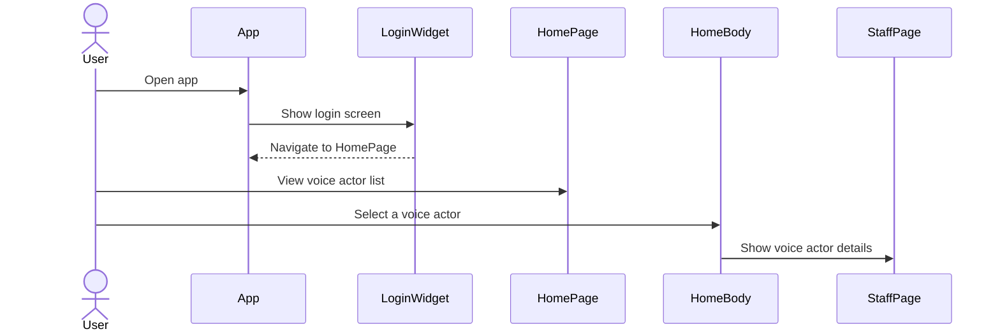

# Anime Convention

A new Flutter project for managing anime conventions.

## Table of Contents

- [Getting Started](#getting-started)
- [Development Guide](#development-guide)
    - [Creating a New Feature](#creating-a-new-feature)
    - [Flutter Code Generation](#flutter-code-generation)
    - [GraphQL](#graphql)
- [Useful Commands](#useful-commands)
- [Sequence Diagram](#sequence-diagram)

## Getting Started

To get started with the project, run the following commands:

```shell
flutter pub get
dart run build_runner build --delete-conflicting-outputs
```

## Development Guide

### Creating a New Feature

We use the [feature brick](https://brickhub.dev/bricks/feature_brick/0.6.2#readme) to create new features.

Run the following command inside the `lib` folder:

```bash
mason make feature_brick --feature_name home --state_management riverpod
```

### Flutter Code Generation

To watch and build continuously:

```bash
dart run build_runner watch
```

To rebuild a single time:

```bash
dart run build_runner build --delete-conflicting-outputs
```

### GraphQL

To get a new schema:

```bash
get-graphql-schema https://graphql.anilist.co > lib/schema.graphql
```

## Useful Commands

- To run the Flutter app:

    ```bash
    flutter run
    ```

- To run tests:

    ```bash
    flutter test
    ```

- To analyze the code:

    ```bash
    flutter analyze
    ```

### Navigation Sequence Diagram

Below is a sequence diagram illustrating the navigation flow:



---

Feel free to contribute and improve this project. Happy coding!